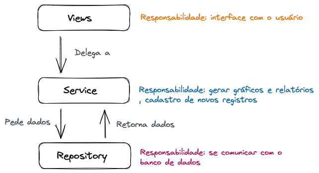

# Trabalho Conflitos Bélicos - Parte 3 - ACH2004 Bancos de Dados 1

<!-- TOC -->
  * [Alunos](#alunos)
  * [Desenvolvimento](#desenvolvimento)
    * [Arquitetura](#arquitetura)
      * [Views](#views)
      * [Services](#services)
      * [Repositories](#repositories)
    * [Configuração do Banco de Dados](#configurao-do-banco-de-dados)
<!-- TOC -->

## Alunos
| Nome                      | NUSP     |
|---------------------------|----------|
| João Eduardo da Paz Silva | 11845514 |
| Ryan ||
| Vinicius ||
| Silas ||

## Como executar

### PostgreSQL e Docker Compose

Para executar o projeto, é necessário ter uma instância do PostgreSQL executando localmente com as seguintes configurações:

| Configuração | Valor      |
|--------------|------------|
| Host         | localhost  |
| Port         | 5432       |
| Database     | ep_db      |
| User         | ep_db_user |
| Password     | ep_db_pass |

Para facilitar a configuração de tal banco de dados, é fornecido um [docker-compose.yml](docker-compose.yml). Para executá-lo, basta ter o `docker-compose` habilitado executar o seguinte comando na pasta raiz do projeto, através de um terminal:

```bash
docker-compose up
```
ou
```bash
sudo docker-compose up
```

caso o sistema exija privilégios de administrador.

### Baixando as dependências e compilando o projeto com Gradle

```bash
./gradlew shadowJar
```

### Executando o projeto

Uma vez que o projeto esteja compilado, basta executar o seguinte comando:

```bash
java -jar build/libs/ep-bd-1.0-SNAPSHOT-all.jar
```

O projeto irá configurar e popular o banco de dados apenas na primeira execução.

## Desenvolvimento

O projeto foi desenvolvido usando o SGBD PostgreSQL e a linguagem de programação Java em sua versão 17 incluindo, além de algumas bibliotecas nativas, as seguintes bibliotecas externas:

- Spring Context: para facilitar a injeção de dependência.
- PostgreSQL JDBC Driver: para se conectar com o banco de dados.
- Java Text Utilities: para formatar tabelas.
- TODO: biblioteca dos gráficos

### Arquitetura

As responsabilidades do projeto foram divididas em três camadas:



#### Views

Na camada Views, que se encontra no pacote `org.example.views`, está implementada toda a lógica de interação com o usuário através do terminal. Para gerar os relatórios e gráficos e permitir o cadastro de novos registros no banco de dados, a Views delega essa responsabilidade para a Services.

Cada classe da Views lida com um menu em específico. A `MainMenu` é a que está no topo da hierarquia:

```java
  public void run() {
    while (true) {
      String chosenOption = getValidInputWithOptions(scanner, """
          \n*** Conflitos Belicos - Menu Principal ***
          [1] - Fazer novos cadastros
          [2] - Gerar relatorios e graficos
          [Q] - Sair do programa
          """, List.of("1", "2", "Q"));

      switch (chosenOption) {
        case "1" -> registrationMenu.run();
        case "2" -> reportsMenu.run();
        case "Q" -> quit();
      }
    }
  }

```


#### Services

TODO

#### Repositories

TODO

### Configuração do Banco de Dados

Toda a conexão e setup inicial das tabelas do banco de dados estão na classe `org.example.repository.DatabaseConfig`:

```java
  public static void setup() throws SQLException {
    System.out.println("Setting up database...");
    var connection = databaseConnection();

    var statement = connection.createStatement();

    try (statement) {
      boolean hasAlreadySetup = isDatabaseAlreadySetup(statement);

      if (hasAlreadySetup) {
        System.out.println("Database already setup");
        return;
      }

      createTables(statement);
      createTriggers(statement);
      populateTables(statement);
    }
  }
```

Os scripts de criação de tabelas podem ser encontrados no método `DatabaseConfig.createTables`, os scripts de criação de triggers no método `DatabaseConfig.createTriggers` e os scripts de inserção de dados de teste no método `DatabaseConfig.populateTables`.
